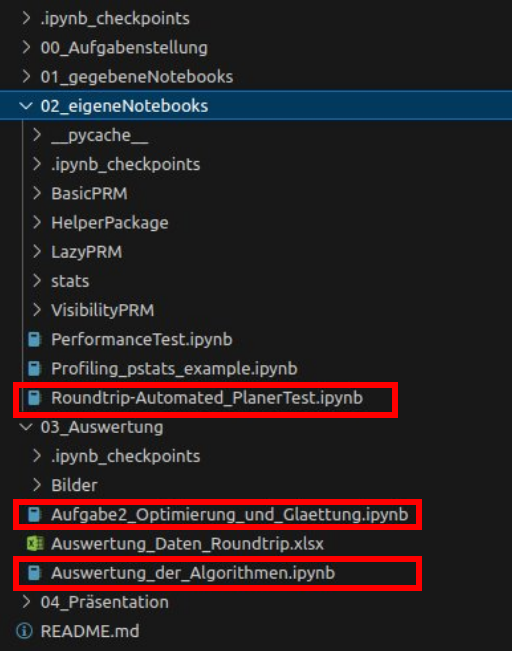

# RKIM23RobotProgramDS #
## Wie werden die Algorithmen ausgeführt?

### Roundtrip-Automated_PlanerTest
In dieser Datei werden die Benchmarks ausgeführt und visualisiert (analog der Vorlage AutomatedPlanerTest).

### Aufgabe2_Optimierung_und_Glaettung
In dieser Datei befindet sich die Lösung zu Aufgabe 2.

### Auswertung_der_Algorithmen
In dieser Datei befindet sich die Beschreibung der Pfadplanung, sowie die schriftliche Auswertung der Ergebnisse.

### Performance Auswertung

Die Performance Auswertung befindet sich in der Excel Tabelle "Auswertung_Daten_Roundtrip.xlsx" und wurde mit dem Jupyter Notebook "PerformanceTest" erstellt. Hier sind alle Testdaten, sowie zugehörige Diagramme hinterlegt. 

## Aufgabenstellung: P5 – Roundtrip-Path ##

I. Implementieren Sie einen Roundtrip-Path Planer.

a) Gegeben sind  
* Startposition  
* Mehrere Endpositionen  
* Das Interface des Roundtrip-Path-Planners soll sich nicht von den anderen
Bahnplanern unterscheiden.  
* Der zu verwendete Bahnplanungsalgorithmus soll wählbar sein und
geeignet übergeben werden können.  
* Ausgabe: Ein kollisionsfreier Pfad, der von der gegebenen Startposition alle
Endpositionen genau einmal erreicht. Kodieren den Pfad geeignet, so dass
sich erkennen lässt, was Start-Punkt, kollisionsfreier Zwischenpfad und
Zielpunkte sind.  

b) Evaluieren Sie mit BasicPRM, LazyPRM, VisibilityPRM anhand von mindestens 5
Benchmarkumgebungen. Stellen Sie die Ergebnisse grafisch da und diskutieren Sie
diese. Stellen Sie insbesondere den Lösungspfad dar.

c) In einem weiteren Schritt entwickeln Sie eine spezielle Variante auf Basis des
Visibility PRM, der die Eigenschaften des Verfahrens vorteilhaft nutzt. Hier müssen
Sie eventuell eine die Art wie Sie den Visibility-PRM aufrufen geschickt verändern.
Führen Sie ebenfalls die Evaluation an den Benchmarkumgebungen durch und
vergleichen Sie die Ergebnisse.

II. Erläutern Sie bitte zudem im Endbericht:

Wie können Sie die Bewegungsbahnen optimieren/Glätten? Erläutern Sie kurz eine
mögliche Vorgehensweise.
 
Anmerkung: Bitte checken Sie das Notebook „Profiling_pstats_example“ und „IP-X-0-
Automated_PlanerTest“ für Profiling und Statistiken.
